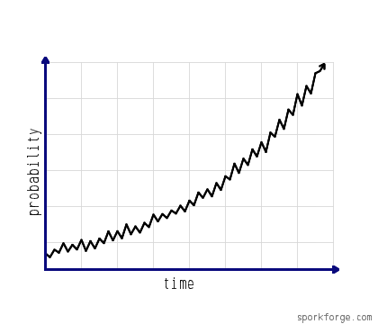

# laze
*Lazy Exceptions*

*laze* came into existence after a careful study of dozens of programmers' workflows. To sum the study up briefly, the
conclusion was that, *given enough time to debug a problem, probability of a programmer to copy and paste the exception
message to find a solution on stackoverflow tends to one.*

*laze* tries to save precious programmer time, allowing aforementioned possibility to reach one instantaneously. By
decorating your entry point function with `@laze`, you can make *laze* to catch **any** exception, analyze it, run a
query on stackoverflow, and return you the results to directly jump to the solution.

The goal of the project to evolve it into an Artificial Intelligence that can directly copy paste solutions from
stackoverflow (after changing the variables' names of course!) so that you will not even notice the error.

## Usage
* Decorate a function that you want to catch its exceptions (usually the entry point of you program)
* Try developing your software until inevitably coming across an exception
* Let the *laze* do it's job
  * After printing the exception, it will search stackoverflow for a possible solution
    * *laze* utilizes pretty advanced techniques while analyzing the exception. Instead of just copy-pasting like most
      of the *"programmers"*,
      it tries to be more clever than that by looking for different tags and removing non-relevant information. So
      please be patient, and wait at least 3 seconds. You might try to debug it yourself in the meanwhile though...
  * Then it will show you the results, ordered by their relevancy. You might scroll through them by just pressing enter,
    or you can choose one by entering a number between 0-9. You can quit by entering "q" or "quit".
  * Lastly, if you feel extremely hopeless, you can send a keyboard interrupt (^C) and go to the "Ask Question" page of
    stackoverflow. Please do not forget to write "urgent" in all capitals in the title, and to start your question with
    "please help!".
    
## License
**Sun Industry Standards Source License 1.0**

> The contents of this file are subject to the Sun Standards License Version 1.1 (the "License");
>
> You may not use this file except in compliance with the  License. You may obtain a copy of the
> License at https://www.openoffice.org/licenses/sissl_license.html.
>
> Software distributed under the License is distributed on an "AS IS" basis, WITHOUT WARRANTY OF ANY KIND, either 
> express or implied. See the License for the specific language governing rights and limitations under the License.
>
> The Original Code is https://github.com/boramalper/laze.
>
> The Initial Developer of the Original Code is: 
> 
> Mert Bora Alper
>
>
> All Rights Reserved.

----

To prevent *laze* to become aware of itself, please do not use it to debug *laze*.